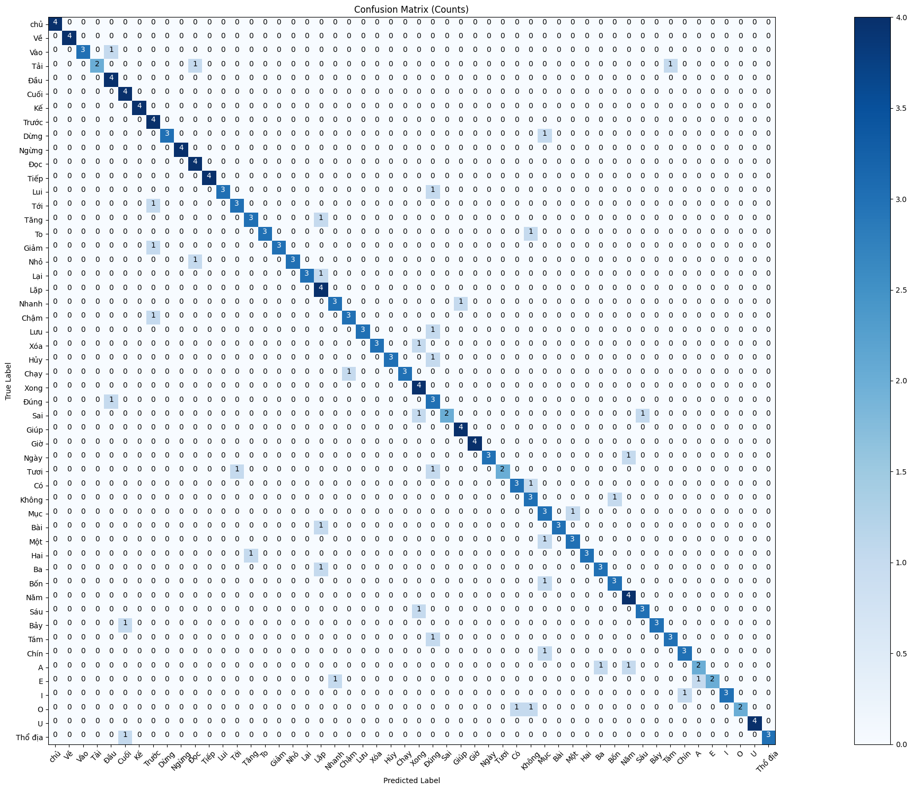
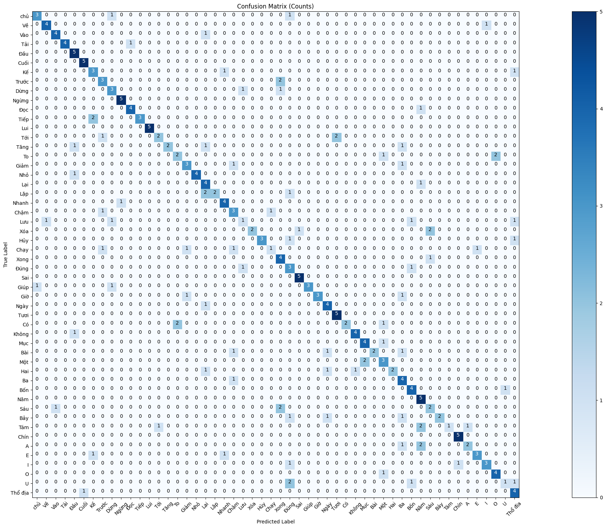

# Hidden_Markov_Model
- This project implements a system using Hidden Markov Models (HMM).
- Using Mel Frequency Cepstral Coefficients (MFCCs) for feature extraction.
- The training set data consists of 52 words, each with 20 samples.
- The required libraries are included in the requirements.txt
## Feature extraction
- run preprocessing.py to extract features

## Train Model
- run trainModel.ipynb train model with train:test = 8:2
- run trainCrossValidation.ipynb train model with k=5

> With n_states=7, n_mixtures=3,  n_features=13 and k=5

|    |Fold1|Fold2|Fold3|Fold4|Fold5|avg|
|:---|:---:|:---:|:---:|:---:|:---:|:--:|
|Accuracy|0.80|0.77|0.67|0.88|0.6|**0.7431**|

## Test Model
The best set of hyperparameters for the modal is: n_states = 7, n_mixtures = 3,  n_features = 13
- Accuracy =  **64,62%**
